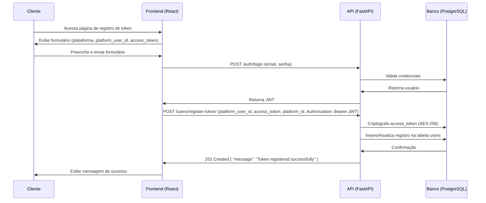
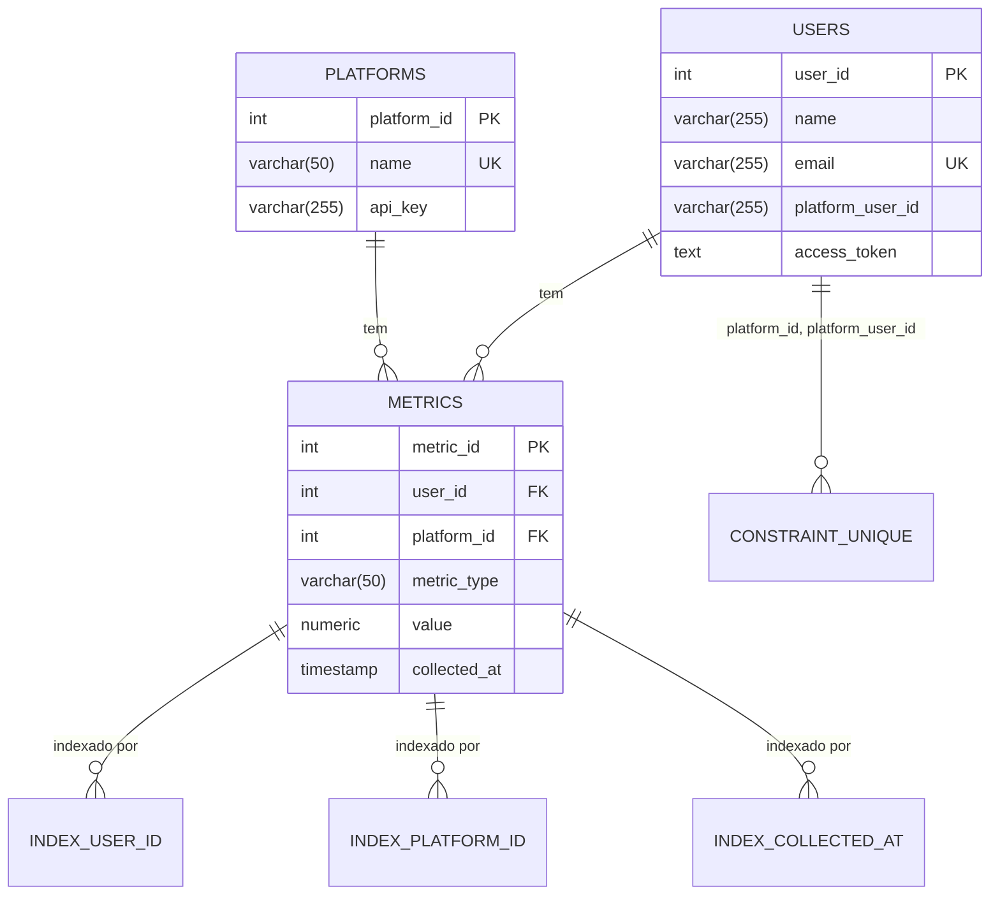

# UML de Fluxo e ER de Banco - Social Media Metrics API

Este documento fornece diagramas visuais para a **Social Media Metrics API**: um diagrama UML de sequência para o fluxo de **Registro de Token** e um diagrama ER para o banco de dados PostgreSQL. Os diagramas complementam os 420 prompts e o PRD, sem alterar o escopo.

## 1. UML de Fluxo: Diagrama de Sequência (Registro de Token)

O diagrama abaixo representa o fluxo de usuário **Registro de Token** (Fluxo 1 do PRD), onde um cliente associa um `platform_user_id` e `access_token` a uma plataforma.

**Notas**:
- O cliente já deve ter um `access_token` válido da plataforma (ex.: Instagram).
- A API valida o JWT antes de processar a requisição.
- O `access_token` é criptografado antes de ser salvo (Tarefa 152).

## 2. ER de Banco: Diagrama Entidade-Relacionamento

O diagrama abaixo representa o esquema do banco de dados PostgreSQL, com as tabelas `users`, `platforms`, e `metrics`, incluindo atributos, chaves primárias, estrangeiras, e índices.

**Notas**:
- **Tabela `users`**:
  - `user_id`: Chave primária.
  - `email`: Único.
  - `access_token`: Criptografado (AES-256).
  - Constraint: Unicidade em `(platform_id, platform_user_id)` (Tarefa 29).
- **Tabela `platforms`**:
  - `platform_id`: Chave primária.
  - `name`: Único (ex.: Instagram).
- **Tabela `metrics`**:
  - `metric_id`: Chave primária.
  - `user_id` e `platform_id`: Chaves estrangeiras.
  - Índices em `user_id`, `platform_id`, `collected_at` para consultas rápidas (Tarefa 23).
- **Relacionamentos**:
  - Um usuário tem várias métricas (1:N).
  - Uma plataforma tem várias métricas (1:N).