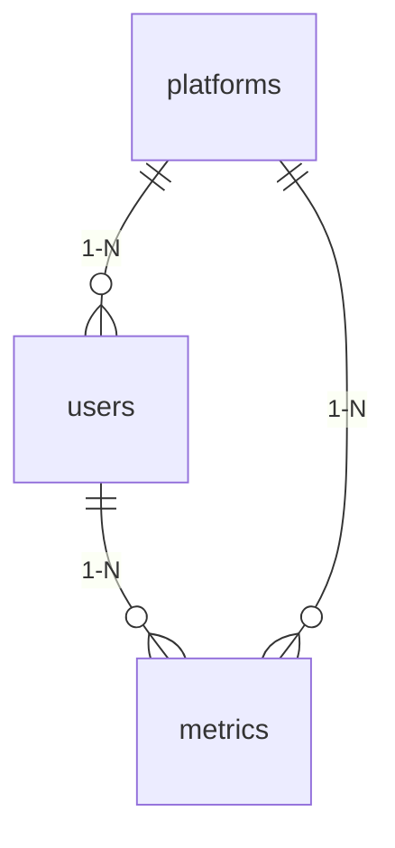

# Esquema do Banco de Dados

## Tabelas Principais

### users
- **id**: Integer (PK)
- **username**: String(50) (UNIQUE)
- **email**: String(255) (UNIQUE)  
- **hashed_password**: String(255)
- **is_active**: Boolean
- **platform_id**: Integer (FK para platforms)
- **platform_user_id**: String(255)
- **created_at**: TIMESTAMP

**Constraints**:
- UNIQUE(platform_id, platform_user_id)
- FOREIGN KEY(platform_id) REFERENCES platforms(id)

### platforms
- **id**: Integer (PK)
- **name**: String(50) (UNIQUE)
- **api_endpoint**: String(255)

### metrics
- **id**: Integer (PK)  
- **user_id**: Integer (FK para users)
- **platform_id**: Integer (FK para platforms)
- **metric_type**: String(50)
- **value**: Numeric
- **collected_at**: TIMESTAMP

## Relacionamentos

## Índices

- users.username (UNIQUE)
- users.email (UNIQUE)  
- users.platform_id + users.platform_user_id (UNIQUE)
- metrics.user_id
- metrics.platform_id
- metrics.collected_at